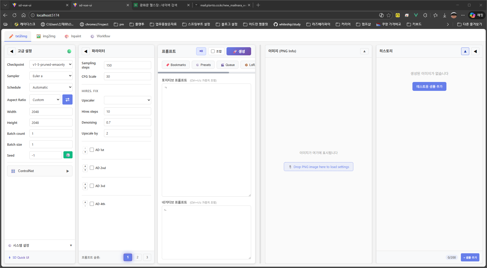
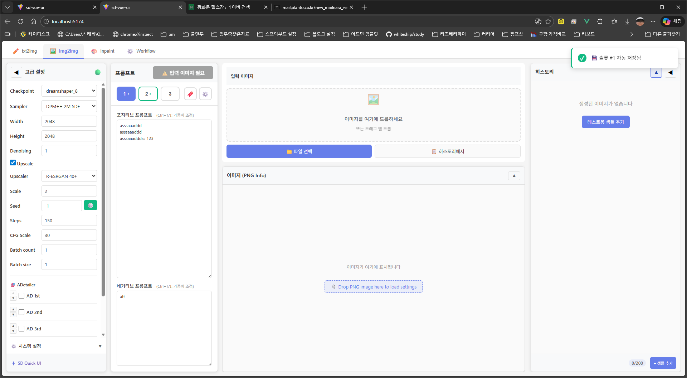
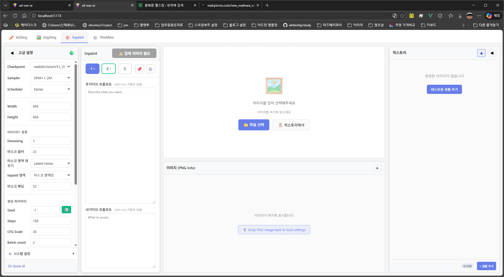
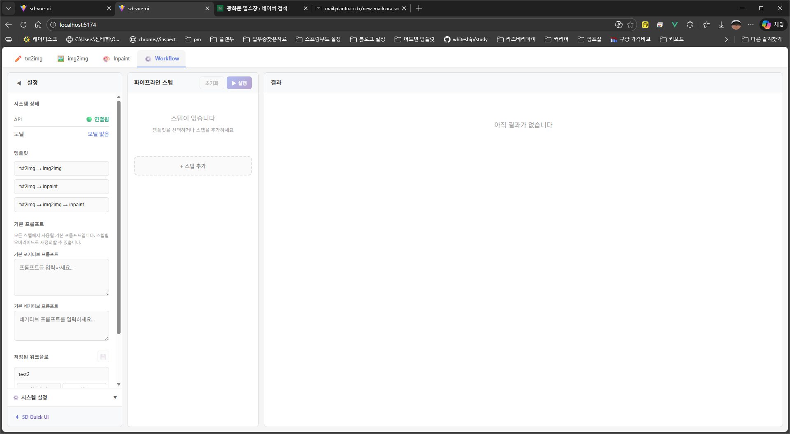
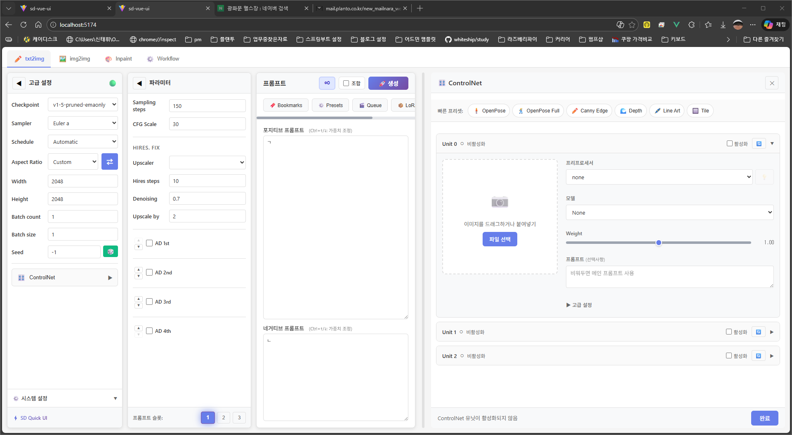
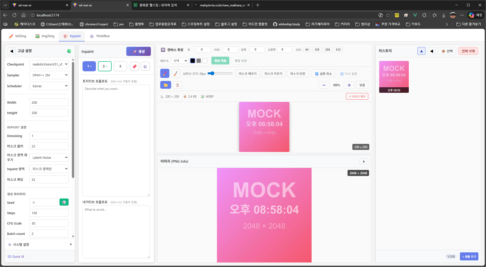
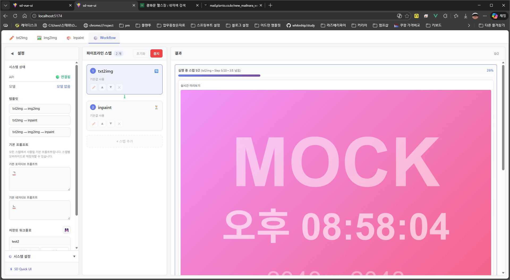
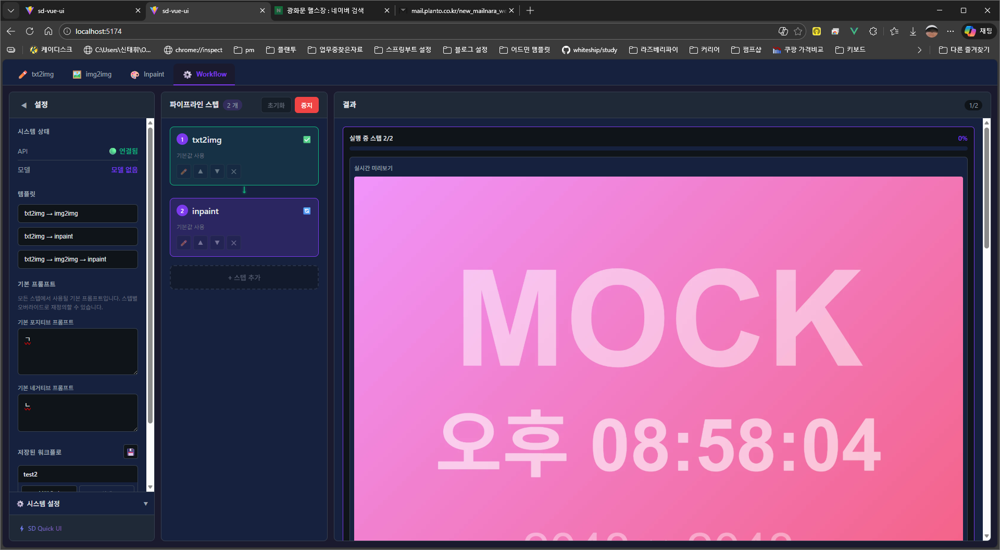

# SD Quick UI

> A lightweight Vue 3 frontend for Stable Diffusion WebUI (AUTOMATIC1111)

Alternative UI supporting **txt2img**, **img2img**, **inpaint/outpaint**, **ControlNet**, and **Workflow pipelines**. Built with simplicity and speed in mind.



## Features

### Generation Modes

| Mode | Description |
|------|-------------|
| **txt2img** | Text-to-image with full parameter control |
| **img2img** | Image-to-image transformation |
| **Inpaint/Outpaint** | Mask-based editing and canvas expansion |
| **Workflow** | Multi-step pipelines (txt2img → img2img → inpaint) |

### Core Features

- **Prompt Slots** - 3 independent configuration snapshots per tab (prompts + all parameters)
- **ControlNet** - OpenPose, Canny, Depth, Lineart, Tile presets with preview
- **ADetailer** - Up to 4 simultaneous detailers with individual prompts
- **Hires Fix** - All upscalers supported
- **Infinite Mode** - Continuous generation with random seeds
- **Queue System** - Batch generation management
- **Bookmarks & Presets** - Save/load prompt combinations and parameters

### Productivity

- **Real-time Progress** - Live preview during generation
- **History Panel** - Browse recent generations with metadata
- **PNG Info** - Drag & drop to load parameters from images
- **LoRA Browser** - Visual LoRA selection with thumbnails
- **Keyboard Shortcuts** - Ctrl+Enter to generate, Ctrl+1/2/3 for slots

### UI/UX

- **Dark/Light Mode** - System-aware theme switching
- **Bilingual** - Korean and English support
- **Tab Persistence** - Generation continues when switching tabs
- **Responsive Panels** - Resizable and collapsible sections

## Screenshots

### Generation Tabs

| txt2img | img2img | inpaint | workflow |
|---------|---------|---------|----------|
|  |  |  |  |

### ControlNet



### Inpaint Canvas



### Workflow Pipeline



### Dark Mode



## Quick Start

### Prerequisites

- [Stable Diffusion WebUI](https://github.com/AUTOMATIC1111/stable-diffusion-webui) (AUTOMATIC1111) v1.7.0+
- [Node.js](https://nodejs.org/) v18+

### Installation

```bash
# Clone repository
git clone https://github.com/rauohon/sd-quick-ui.git
cd sd-quick-ui

# Install dependencies
npm install

# Start development server
npm run dev
```

### WebUI Configuration

Start WebUI with API enabled:

```bash
# Windows (webui-user.bat)
set COMMANDLINE_ARGS=--api --cors-allow-origins=http://localhost:5173

# Linux/Mac
./webui.sh --api --cors-allow-origins=http://localhost:5173
```

### Access

Open http://localhost:5173 in your browser.

## Usage

### Prompt Slots

Each slot stores the **entire generation configuration**:
- Prompts (positive/negative)
- Parameters (steps, CFG, sampler, size, seed)
- Hires Fix settings
- ADetailer configurations
- Batch settings

Switch between 3 slots instantly with one click or Ctrl+1/2/3.

### Workflow Pipelines

Create multi-step generation workflows:

```
txt2img → img2img → inpaint
```

Each step can override parameters (denoising, steps, prompts).

### ControlNet

Quick presets available:
- OpenPose (pose detection)
- Canny (edge detection)
- Depth (depth map)
- Lineart (line extraction)
- Tile (upscale/detail)

### Keyboard Shortcuts

| Shortcut | Action |
|----------|--------|
| `Ctrl+Enter` | Generate |
| `Ctrl+1/2/3` | Switch slot |
| `Ctrl+/` | Focus prompt |
| `ESC` | Close modal |
| `B` | Brush tool (inpaint) |
| `E` | Eraser tool (inpaint) |

## Development

```bash
# Development with real API
npm run dev

# Development with mock API (no WebUI needed)
npm run dev:mock

# Build for production
npm run build

# i18n validation
npm run i18n:validate
```

## Tech Stack

- **Vue 3** - Composition API
- **Vite** - Build tool
- **vue-i18n** - Internationalization

Minimal dependencies by design (4 total).

## Project Structure

```
src/
├── views/           # Main views (Txt2Img, Img2Img, Inpaint, Workflow)
├── components/      # Reusable UI components
├── composables/     # Vue composables (state & logic)
├── config/          # Constants and configuration
├── i18n/            # Translations (en, ko)
└── utils/           # Utility functions
```

## Contributing

Bug fixes and improvements welcome. Please:

1. Fork the repository
2. Create a feature branch
3. Keep changes focused
4. Submit a PR with clear description

For large features, consider forking instead.

## License

[MIT](LICENSE)

## Acknowledgments

- [AUTOMATIC1111/stable-diffusion-webui](https://github.com/AUTOMATIC1111/stable-diffusion-webui)
- [Stability AI](https://stability.ai/)
- [Vue.js](https://vuejs.org/)
